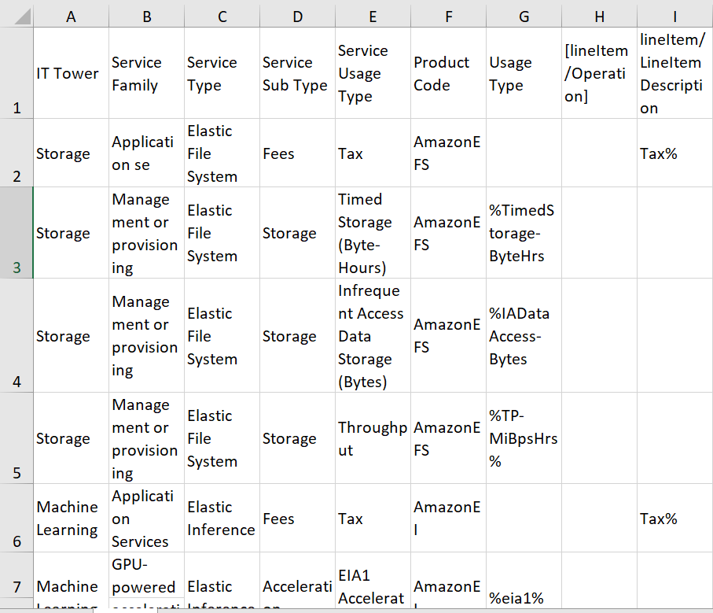

# Лабораторная работа №2 (AWS)

### Цель работы

Изучение облачных сервисов, углубленный анализ различных уровней абстракции инфраструктуры в облачной среде, освоение моделей потребления облачных услуг и сравнение сервисов между различными провайдерами для более точной оценки возможности перехода на отечественные платформы.

### Конвертация файла .csv в формат Excel

### Классификация сервисов

Мне было предложено несколько столбцов в Excel для распределения сервисов по различным параметрам. Вот что удалось выяснить о каждом из них:

| Параметр              | Описание                                                                 |
|-----------------------|-------------------------------------------------------------------------|
| **IT Tower**          | Группа, отвечающая за управление инфраструктурой, поддержку и анализ характеристик сервисов: `Storage`, `Machine Learning`, `DatabaseYandex`, `Cloud Apps` и др. |
| **Service Family**    | Кластер сервисов для выполнения конкретных задач и интеграции с приложениями: `Application services`, `In-memory caching service` и др. |
| **Service Type**      | Категория сервисов в рамках группы: `GuardDuty`, `Elastic File System`, `Kinesis` и др.             |
| **Service Sub Type**  | Подтип сервиса с определенными функциями: `Fees`, `Cache Node` и др.                                 |
| **Service Usage Type**| Режим использования сервиса с учетом его подтипа: `Tax`, `Standard Timed storage` и др.            |

### Описание сервисов и их отечественные аналоги

В процессе работы я изучила несколько сервисов AWS и постаралась найти их аналоги на платформе Yandex Cloud.

1. **Amazon Elastic File System (EFS)**
   Масштабируемое и полностью управляемое файловое облачное хранилище, обеспечивающее общий доступ к файлам. Предназначено для приложений, требующих высокой доступности данных. EFS поддерживает стандартный и инфреквентный доступ к данным, оптимизируя затраты.

   **Аналог:**
   Yandex Object Storage — облачное хранилище с возможностью создания сетевых дисков (NFS) для распределенного доступа.

2. **Amazon Elastic Inference**
   Сервис, добавляющий ускорители глубокого обучения для повышения эффективности работы моделей машинного обучения.

   **Аналог:**
   Прямого аналога нет. Однако Yandex.Cloud предоставляет сервисы для обучения моделей, такие как "Тренировка моделей в облаке".

3. **Amazon ElastiCache**
   Управляемое кеширование для повышения производительности приложений.

   **Аналог:**
   Managed Service for Redis — сервис кеширования, основанный на технологии Redis.

4. **Amazon GuardDuty**
   Служба для обнаружения угроз в облачной среде, анализирующая логи и данные для выявления аномалий.

   **Аналог:**
   Yandex Smart Web Security — обеспечивает анализ и выявление угроз в облачной среде.

5. **Amazon Kinesis**
   Платформа для сбора, обработки и анализа потоковых данных в реальном времени.

   **Аналог:**
   DataLens — инструмент для обработки потоковых данных.

6. **Amazon Lightsail**
   Простое решение для виртуального хостинга и вычислительных ресурсов.

   **Аналог:**
   Виртуальные выделенные серверы (VDS) с гибкой настройкой параметров.

7. **Amazon Kendra**
   Сервис для поиска данных внутри организации с использованием алгоритмов ИИ.

   **Аналог:**
   Полного аналога нет. Однако YandexGPT 2 частично может выполнять схожие задачи.

8. **Amazon Lex**
   Сервис для создания чат-ботов с поддержкой распознавания речи и естественного языка.

   **Аналог:**
   Yandex SpeechKit — инструмент для обработки речи. Частично подходит Yandex Dialogs для создания голосовых приложений.

9. **Amazon Redshift**
   Облачное хранилище для аналитической обработки больших объемов данных.

   **Аналог:**
   Yandex Compute Cloud — предоставляет масштабируемые вычислительные мощности.

10. **Amazon Registrar**
    Сервис управления трафиком для доменов.

    **Аналог:**
    Yandex.Cloud DNS — позволяет управлять доменами и настраивать DNS записи.

### Таблица с результатами

Результаты исследований представлены в таблице [здесь](./aws_results.csv).

### Выводы

В результате лабораторной работы я изучила сервисы AWS и нашла их аналоги на платформе Yandex Cloud. Для большинства сервисов AWS удалось найти соответствующие альтернативы, но некоторые из них не имеют полного аналога. Это указывает на то, что миграция на Yandex Cloud возможна, но может быть сопряжена с рисками и не всегда оправдана.

