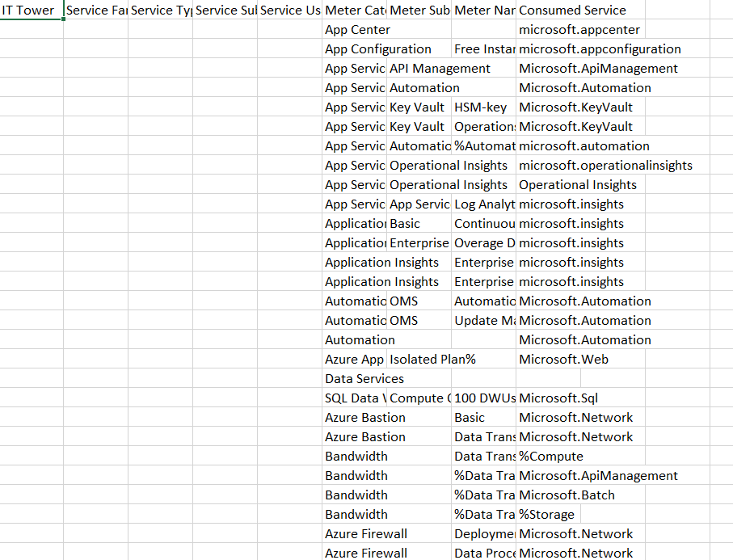

### Лабораторная работа №2 (Azure)

#### Цель работы

Изучить облачные сервисы, их возможности и модели потребления. Освоить концепцию уровней абстракции в облаке. Провести анализ сервисов разных провайдеров и оценить возможность миграции с платформы Azure на отечественные облачные решения, такие как Yandex Cloud.

---

#### Дано

1. Слепок данных биллинга провайдера, предварительно обработанный и представленный в виде SQL-параметров. Символ `%` в начале или конце указывает на возможность добавления любых символов до или после него.
2. Доступ к документации провайдера через Google.

*Пример слепка данных биллинга:*

---

#### Описание сервисов

В слепке данных были упомянуты следующие сервисы Azure: **Azure App Center**, **Azure App Configuration**, **Azure App Service**, **Azure Application Insights**, **Azure Automation**, **Azure Bastion**, **Azure Firewall**, **Azure Notification Hubs**, **Azure Power BI**, **Azure Site Recovery**, **Azure Virtual Machines**, **Azure SQL Data Warehouse**.  
Были кратко описаны их функции и найдены отечественные аналоги на Yandex Cloud.

---

#### Сервисы и их аналоги

1. **Azure App Center**  
   Платформа для разработки, тестирования и развертывания мобильных приложений. Поддерживает непрерывную интеграцию и тестирование.  
   **Аналог в Yandex Cloud:** [Yandex Cloud Apps](https://cloud.yandex.ru/services/appload-balancer).

2. **Azure App Configuration**  
   Централизованное управление конфигурацией приложения, позволяющее изменять параметры без пересборки.  
   **Аналог в Yandex Cloud:** [Yandex Cloud Apps](https://cloud.yandex.ru/services/appload-balancer).

3. **Azure App Service**  
   Платформа для создания веб-приложений, API и мобильных бэкэндов с инструментами масштабирования.  
   **Аналог в Yandex Cloud:** [Yandex Cloud Apps](https://cloud.yandex.ru/services/appload-balancer).

4. **Azure Application Insights**  
   Сервис мониторинга производительности приложений с анализом ошибок и запросов.  
   **Аналог в Yandex Cloud:** [Yandex Cloud Monitoring](https://cloud.yandex.ru/services/monitoring).

5. **Azure Automation**  
   Инструмент автоматизации управления ресурсами в облаке и локально.  
   **Аналог в Yandex Cloud:** Полного аналога нет. Частично могут заменить [Yandex Cloud Functions](https://cloud.yandex.ru/services/functions) и [Yandex Resource Manager](https://cloud.yandex.ru/docs/resource-manager/).

6. **Azure Bastion**  
   Сервис для безопасного доступа к виртуальным машинам без публичных IP.  
   **Аналог в Yandex Cloud:** Полного аналога нет. Частично схожие функции предоставляет [Yandex Compute Cloud](https://cloud.yandex.ru/services/compute).

7. **Azure Firewall**  
   Управляемая служба для защиты виртуальных сетей.  
   **Аналог в Yandex Cloud:** Полного аналога нет. Частично аналогичные функции предоставляют [Yandex Cloud Network Security Groups](https://cloud.yandex.ru/docs/vpc/concepts/security-groups).

8. **Azure Notification Hubs**  
   Сервис для рассылки уведомлений.  
   **Аналог в Yandex Cloud:** Нет, но можно использовать [Yandex Message Queue](https://cloud.yandex.ru/services/message-queue).

9. **Azure Power BI**  
   Платформа для анализа и визуализации данных.  
   **Аналог в Yandex Cloud:** [Yandex DataLens](https://cloud.yandex.ru/services/datalens).

10. **Azure Site Recovery**  
    Сервис резервного копирования и восстановления данных.  
    **Аналог в Yandex Cloud:** [Yandex Cloud Backup](https://cloud.yandex.ru/services/backup).

11. **Azure Virtual Machines**  
    Платформа для развертывания виртуальных машин.  
    **Аналог в Yandex Cloud:** [Yandex Compute Cloud](https://cloud.yandex.ru/services/compute).

12. **Azure SQL Data Warehouse**  
    Аналитическая платформа для работы с большими данными.  
    **Аналог в Yandex Cloud:** [Managed Service for ClickHouse](https://cloud.yandex.ru/services/managed-clickhouse) и [Yandex DataSphere](https://cloud.yandex.ru/services/datasphere).

---

#### Сопоставление сервисов

| **Сервисы Azure**           | **Аналоги в Yandex Cloud**                                      |
|-----------------------------|----------------------------------------------------------------|
| Azure App Center            | Yandex Cloud Apps                                             |
| Azure App Configuration     | Yandex Cloud Apps                                             |
| Azure App Service           | Yandex Cloud Apps                                             |
| Azure Application Insights  | Yandex Cloud Monitoring                                       |
| Azure Automation            | Частично: Yandex Cloud Functions, Yandex Resource Manager     |
| Azure Bastion               | Нет (схожий функционал в Yandex Compute Cloud)               |
| Azure Firewall              | Нет (схожие функции в Network Security Groups, Compute Cloud) |
| Azure Notification Hubs     | Нет (можно использовать Yandex Message Queue)                |
| Azure Power BI              | Yandex DataLens                                              |
| Azure Site Recovery         | Yandex Cloud Backup                                          |
| Azure Virtual Machines      | Yandex Compute Cloud                                         |
| Azure SQL Data Warehouse    | Managed Service for ClickHouse, Yandex DataSphere            |

---

#### Выводы

Анализ сервисов Azure и их аналогов в Yandex Cloud показал, что большинство функций могут быть реализованы в рамках отечественной платформы. Однако для некоторых сервисов Yandex Cloud предоставляет лишь частичный функционал или вовсе не имеет аналогов. Это делает процесс миграции возможным, но сложным и потенциально рискованным в зависимости от требований конкретных задач.